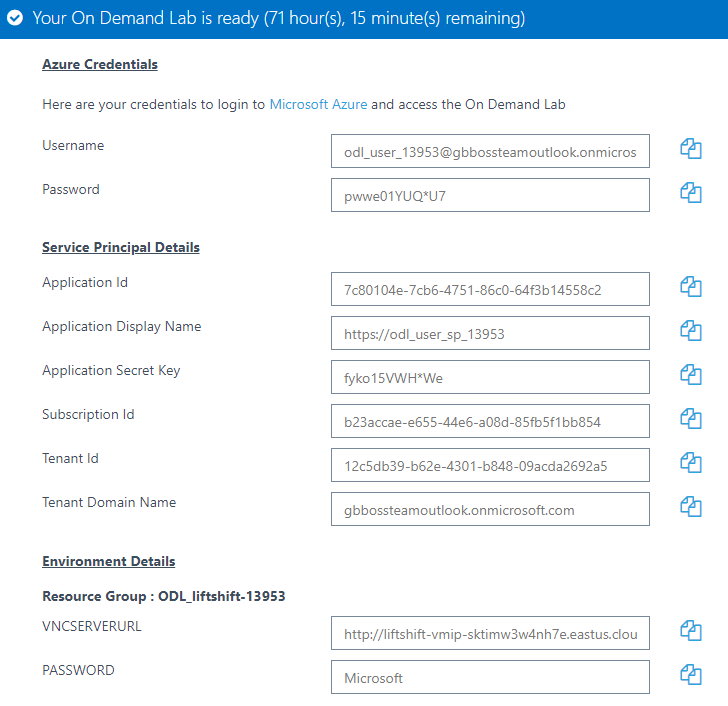
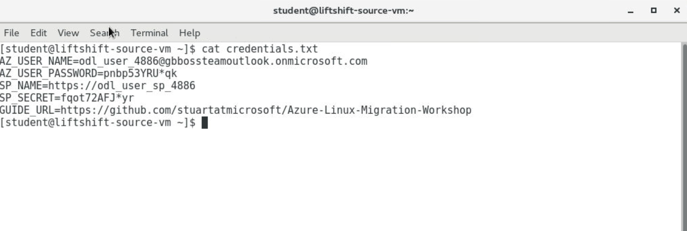

# Intro to Azure CLI

## Expected outcome

In this lab, you will install the Azure Linux CLI on your workstation.  Subsequently, you will sign in and verify access to your Azure subscription.

## How to 

1. <strong>Using your browser go to the Registration Site [here](http://bit.ly/2NwOZo3).</strong>
    * Please make sure you use a valid work email as it will not allow for commercial e-mail domains.

 * Once you select submit, **DO NOT CLOSE THE BROWSER**.
 * On the Lab and Overview page, navigate to the Lab tab and then select Launch Lab

 * The Lab will begin to deploy. **DO NOT CLOSE THE BROWSER**. This will take some time but the needed credentials will be presented on the page when the provisioning is complete.

 * Your credentials will be emails to your signup email address as well as presented on the screen

2. <strong>Launch your web browser of choice and enter the url for the VNC server provided for you. Use the password provided to you in email or on the screen to login.</strong>

 * It may take a minute or so at first launch to get the desktop to present. This is normal at first log in.
 * Mozilla Firefox, Edge, and Internet Explorer have all been tested; Google Chrome has been tested but is buggy.
 * Once this is completed, go to the terminal and you should be ready to start with the Azure CLI instructions below.

3. <strong>Install Azure CLI (AZ CLI) on your workstation</strong>

 * Azure CLI is available for Mac, Windows and Linux.
 * You will need administrator access to install Azure CLI. You can switch user to root with ``su - root``. The password is the same as you used to login to the VNC environment.
 * You can find installation instructions here: [Install Azure CLI](https://docs.microsoft.com/en-us/cli/azure/install-azure-cli-yum?view=azure-cli-latest)
 * It is recommended you open reference material like the Azure CLI reference within your VNC environment so you can easily copy/paste commands.

4. <strong>Log in to your Azure account via the CLI</strong>

 * Use ``az login`` to login to your Azure Account. If a new Firefox window does not appear, please visit ``http://microsoft.com/devicelogin`` and use the provided code to authenticate. On your desktop, open the credentials.txt file to obtain the list of credentials which have been assigned to you.

 * After logging in, your terminal windows will update with a JSON output of your subscription confirming the login has worked
 * If you wish, you may use the ``az configure`` command to change your default output to <strong>3 - Table</strong> format

