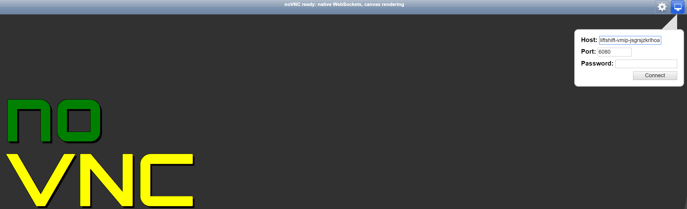
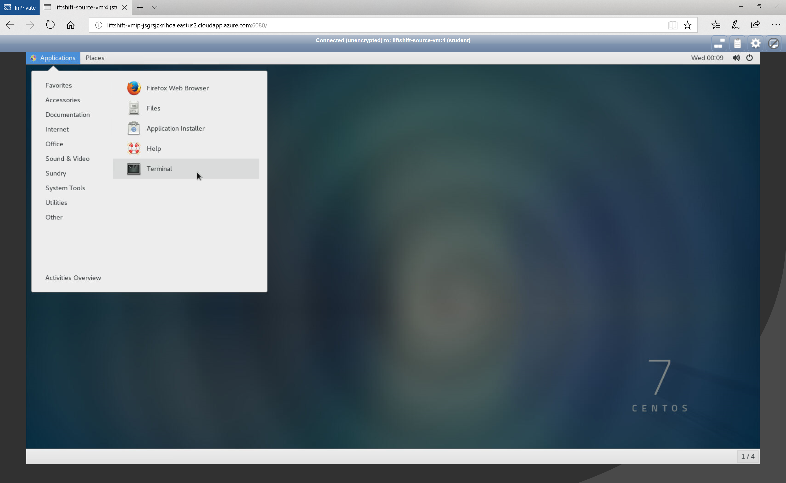
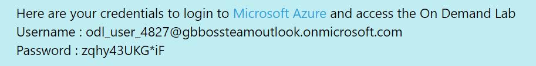

# Intro to Azure CLI

## Expected outcome

In this lab, you will prepare your workstation VM for using the Azure CLI, sign in, and utilize the Azure CLI to deploy basic Azure resources. You will need to have an RDP client on your local PC and access to the web to launch our Hackfest Workstation VM.

## How to 

1. <strong>Using your browser go to the Registration Site listed in your classroom.</strong>
    * Please make sure you use a valid work email as it will not allow for commercial e-mail domains.

 * Once you select submit, **DO NOT CLOSE THE BROWSER**.
 * On the Lab and Overview page, navigate to the Lab tab and then select Launch Lab

    * The Lab will begin to deploy. **DO NOT CLOSE THE BROWSER**. This will take some time but the needed credentials will be presented on the page when the provisioning is complete.

    * Your credentials will be emails to your signup email address as well as presented on the screen

 
 
2. <strong>Launch your your web browser of choice and enter the url for the noVNC server provided for you. Use the password provided to you in email or on the screen to login.</strong>

    * It may take a minute or so at first launch to get the desktop to present. This is normal at first log in.
    * Mozilla Firefox, Edge, and Internet Explorer have all been tested; Google Chrome has been tested but is buggy.
    * Once this is completed, go to the terminal and you should be ready to start with the Azure CLI instructions below.

 
 
3. <strong>Install Azure CLI (AZ CLI) on your workstation</strong>
    * Azure CLI is available for Mac, Windows and Linux.
    * You will need administrator access to install Azure CLI. You can switch user to root with ``su root``. The password is the same as you used to login to the noVNC environment.
    * You can find installation instructions here: [Install Azure CLI](https://docs.microsoft.com/en-us/cli/azure/install-azure-cli-yum?view=azure-cli-latest)
 
 
4. <strong>Log in to your student Azure account via the CLI</strong>
    * Use ``az login`` to login to your lab Azure Account. You will be asked to visit ``https://aka.ms/devicelogin`` and use the provided code to authenticate. Use the credentials provided in your e-mail/Lab Provisioning page.

    * The password is a onetime password and must be changed at first signing in.
    * Your terminal windows will update with a JSON output of your subscription confirming the login has worked.
 
 
5. <strong>Create a new Azure Resource Group using the AZ CLI</strong>
    * You already have a resource group in your subscription. Create the new resource group using the same location as your existing resource group.
    * Name the resource group "MyRG_" followed by your initials
 
 
6. <strong>Configure Azure CLI Defaults</strong>
    * Configure AZ CLI to default to table output
    * Configure AZ CLI to use the same default location as your resource groups
 
 
7. <strong>Log into interactive mode and create a new Azure storage account using the AZ CLI</strong>
    * Make the storage account use Standard Locally Rundandant Storage
    * Create the storage account in the resource group you previously created
    * Create a blob container within this storage account
 
 
8. <strong>Verify you have now created the resource group and storage account in the portal</strong>
    * If not done so already, visit ``https://portal.azure.com``

## Advanced areas to explore

1. If you have time, explore using the Azure Cloud Shell [Azure Portal](https://portal.azure.com). 
2. Try creating your own Azure virtual network using the Azure CLI Cloud Shell
