# Performing a Linux migration to Azure with CloudEndure

## Expected Outcome

This challenge will give you practical experience migrating a running host to Microsoft Azure. While this virtual machine is technically already running in Azure, it is running in a nested virtualization configuration on your host.

Inside the CentOS Linux host that you are using as your desktop, there is a running virtual machine entitled "migrate-host".  It, too, is a CentOS virtual machine running under the KVM hypervisor. Microsoft has partnered with CloudEndure to provide access to their migration toolset to showcase its capabilities and give you hands-on experience with the migration process.  At the end of the challenge, you should have a new virtual machine created in Microsoft Azure which you can SSH to and verify that it is, indeed, the same host.

The source host to be migrated can be an on-premise physical host, a virtual machine on any popular hypervisor (VMWare, KVM, etc), or it may also exist in another public cloud. CloudEndure is agnostic to the source environment and performs a block-level copy of the host into your Azure subscription as part of the replication process.

## Process

1. <strong>Register for a CloudEndure account</strong>
    * Visit & fill out the registration page located at:  https://azure-register.cloudendure.com/
    * Check the account for the e-mail address which you entered, and open the email from "Jonathan Bloom" at CloudEndure regarding "Confirm your CloudEndure account request"
    * Click on the link in the e-mail to "complete this form"

      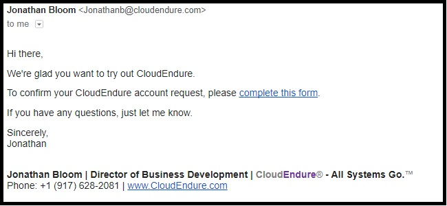

2. <strong>Log in to the CloudEndure Console</strong>
    * Login:  http://www.cloudendure.com

3. <strong>Set Up CloudEndure</strong>

   * You will be presented with a dashboard which will allow you to select the type of project you wish you control.

     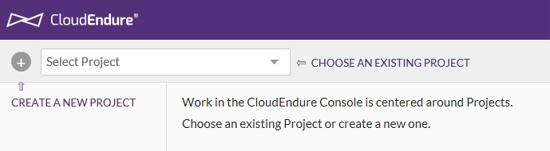

   * <strong>Select "Default Migration Project"</strong>

      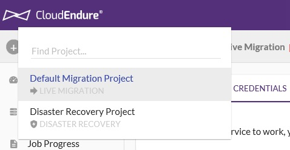

   * <strong>You will then receive an alert message indicating that the CloudEndure console has not yet been configured. You may safely click "Continue" as we will configure the console in the next step.</strong>

      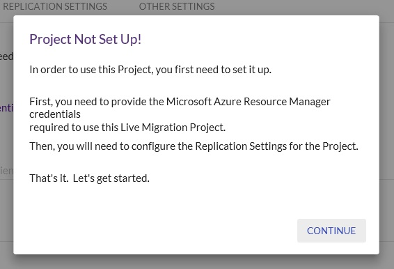

4. <strong>Populate Service Principal Information to CloudEndure console</strong>

    * You must now configure CloudEndure to connect to Microsoft Azure. A service principal has been created for you as part of this challenge exercise and will allow CloudEndure to connect to your subscription.

      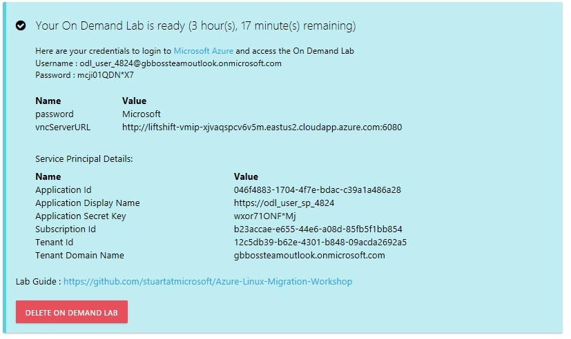

    * Populate the service principal information into the CloudEndure console; Navigate to the "Setup & Info" tab in CloudEndure and then choose the "ARM Credentials" tab.

      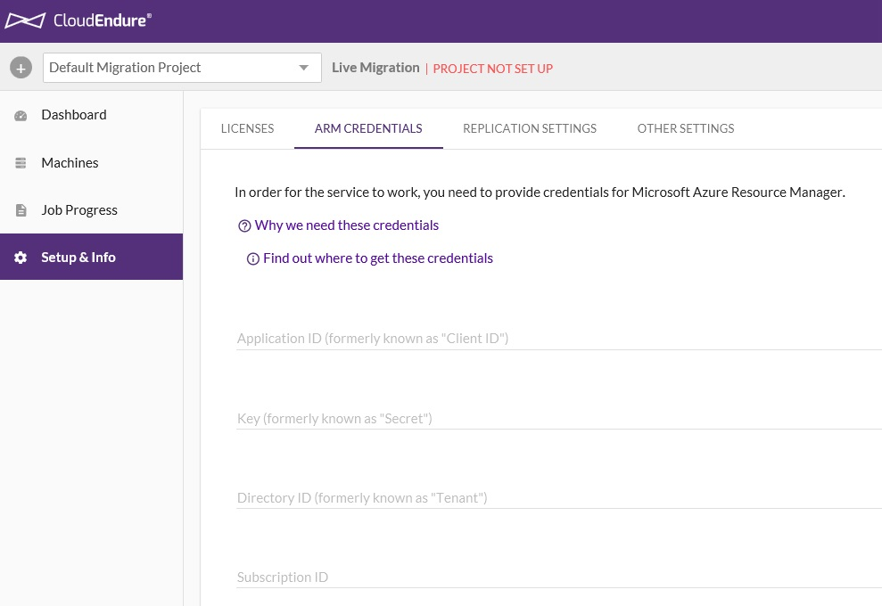

    * Based on the data in this example, the completed page would appear as follows:

      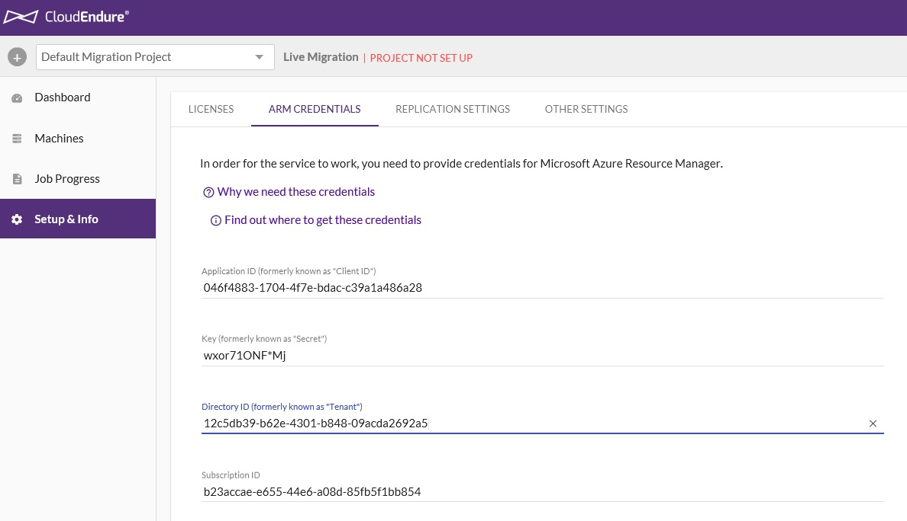

5. <strong>Define the target Replication Settings and specify an Azure Data Center location</strong>

    * After the Service Principal information is entered and saved, you will need to select the target Azure Data Center location for your CloudEndure migration project. Select the "Live Migration Target" drop-down and choose the Azure Data Center "Azure ARM East US 2", "Azure ARM Central US", or "Azure ARM West US 2".

      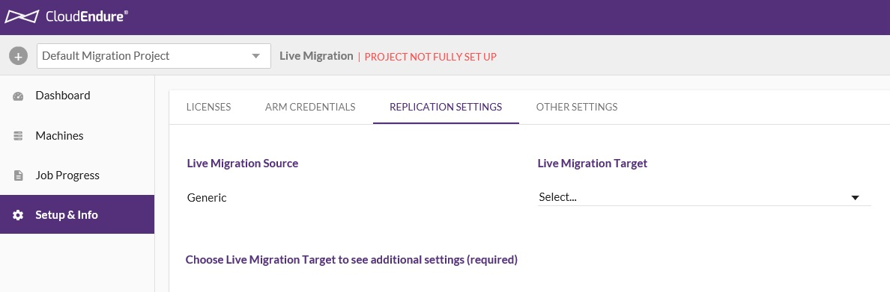

    * In this case, "East US 2" was chosen. After the Azure Data Center is chosen, you may specify which existing virtual network you would like the migrated hosts to be connected to.  In this case, the populated value of <strong>Default</strong> can remain.

      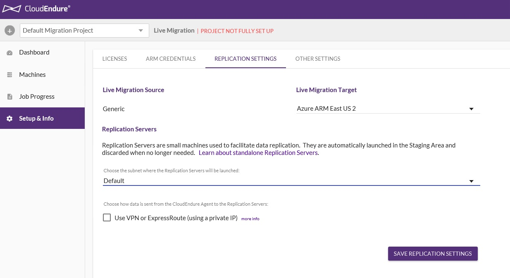

    * After the information is saved, you are now ready to configure your host for migration. Click on "Show Me How"

      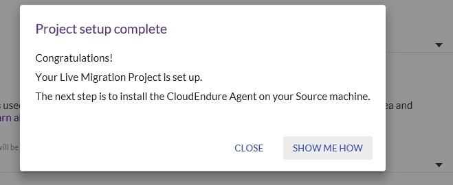

6. <strong>Verify SSH access to the migrate-host virtual machine and prepare it for migration to Microsoft Azure</strong>

    * Determine the IP address of the migrate-host virtual machine. This should be contained in a text file on your CentOS desktop
    * SSH to the migrate-host virtual machine using the IP address and credentials provided
    * Determine if the required Hyper-V drivers are already installed on the migrate-host virtual machine
    * Edit the /etc/dracut.conf file and force-add the Hyper-V drivers required for operation within Microsoft Azure
    * Re-make the initramfs of the migrate-host
    * Verify that the Hyper-V drivers are now installed on the migrate-host virtual machine

7. <strong>Deploy the CloudEndure Migration Agent onto the migrate-host virtual machine</strong>

    * Navigate to the "Machines" tab. The required commands to execute are present on this screen; You will be downloading and installing the CloudEndure migration agent.

      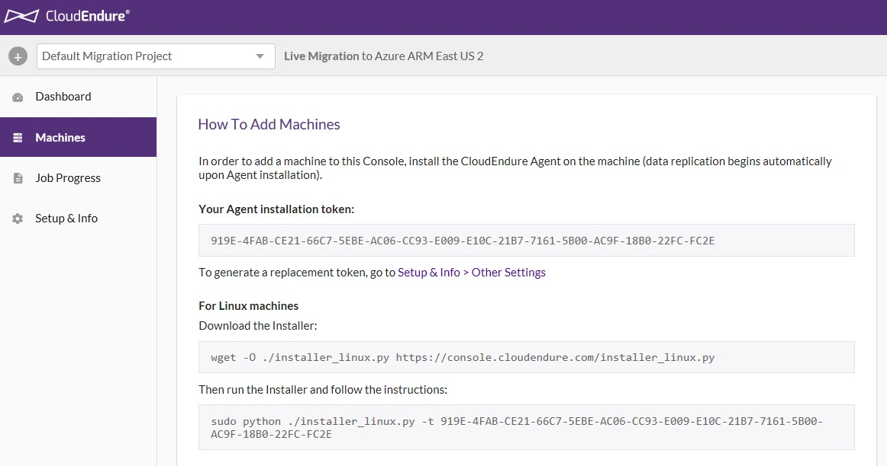 

    * Download and install the CloudEndure Migration Agent

8. <strong>Execute a test migration</strong>

9. <strong>Verify connectivity to the migrated virtual machine</strong>

10. <strong>Perform a migration cut-over</strong>

