# Analyzing the value of a migration to Azure Review dependency mappings & financial analyses

## Expected Outcome

This challenge will provide you hands-on access to the StratoZone assessment tool.  By creating a new assessment and navigating through the tool, you will see how it is able to generate a number of reports on your source environment as you consider a migration to Microsoft Azure.  As part of this challenge we will examine the process of creating an assessment, reviewing data and cloud-fit scores, performing machine shaping and generating a financial model. You will also see how StratoZone is able to integrate with migration tools such as CloudEndure and ASR.

## Process

1. <strong>Create a new assessment</strong>
    * Follow the steps to create a new assessment
     

    * On the details tab, create a location for the assessment that represents a subset of your data center.
     

    * Do not change any of the details on Run Schedule or Data Security (can be changed by your administrators later) -- Just click "Save & Next"
    * The system will email the assessment package as shown on the Downloads tab.  Normally, you would deploy the agentless collector emailed to you onto the host that will be running the tests in your data center, however for the purposes of this lab, the e-mail does not need to be used; We will use the sample data that already been pre-loaded into the StratoZone portal.
    

2. <strong>Review the data to be analyzed</strong>

    * After the assessment package has been generated, click "Done" then click on the "Summary" tab. Here can you see an overview of the data that has been collected by the agents which have been deployed.

    

    * Click on the "Assessments" tab. Multiple on-premise and cloud assessments can be done for all of your locations and will aggregate all of the data into StratoZone

    

    * Click on the "Inventory" tab. This tab will allow you to view the specific inventory sets that have been collected for all of the assessments which have been run.

    

    * In this example, we have expanded the inventory of the "Chicago" location which shows information on all of the host servers that have been registered.

    

    * For the purposes of this lab, the host we will focus on is named "dev-jira"; Click on it and review the data collected

    
 
    * Now click on the "Dependency" tab and drill-down to the same "div-jira" host; Click on it and review the dependency map.  This map is automatically generated by the agents deployed on each host and provides observed host-to-host communication in this model; StratoZone is also able to provide app-to-app level communcation as well. It is crucial to understand server relationships and dependency mappings when planning a migration to Microsoft Azure to ensure services are migrated as a group.

    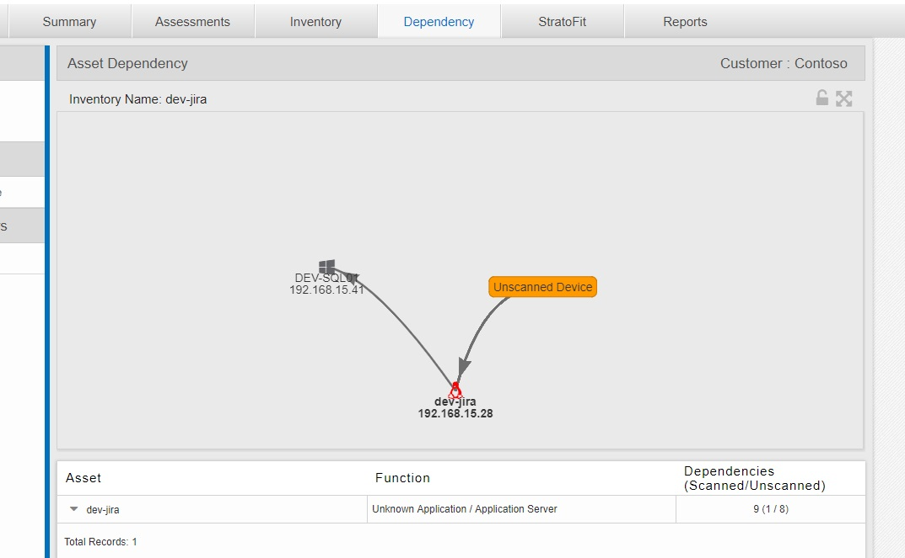

    * Click on the "StratoFit" tab and drill down in the available assessments to the "dev-jira" host to determine the StratoFit rating
    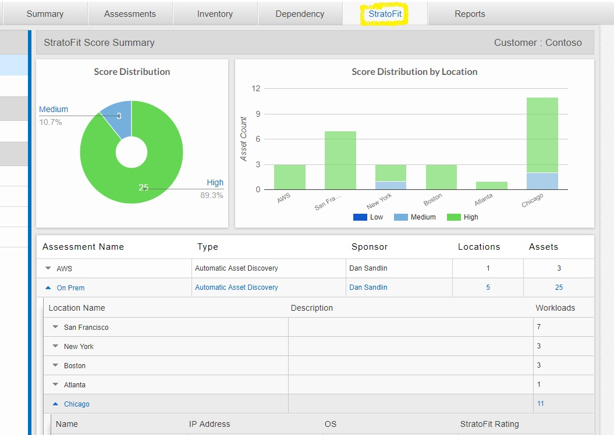

    * Since the StratoFit rating is either "Low" or "Medium", a report is automatically generated showing the items that StratoZone has detected which may require remediation prior to migration to Microsoft Azure.
    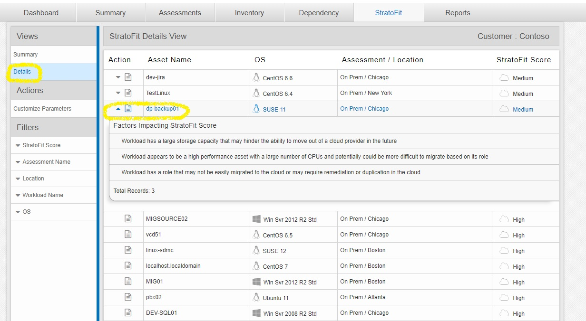

3. <strong>Machine shaping and financial modeling</strong>

   * Click on the "Options" icon next to the "Settings" icon in the upper-right corner of the screen; Choose Plan

   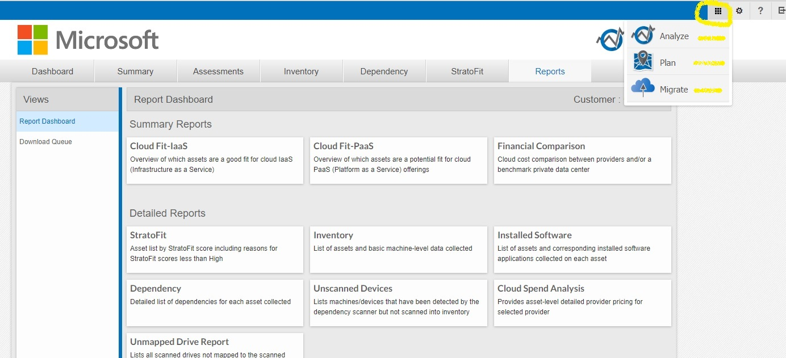

   * Click on the "StratoSpec" tab and drill down to the "dev-jira" host to view its VM resource profile

   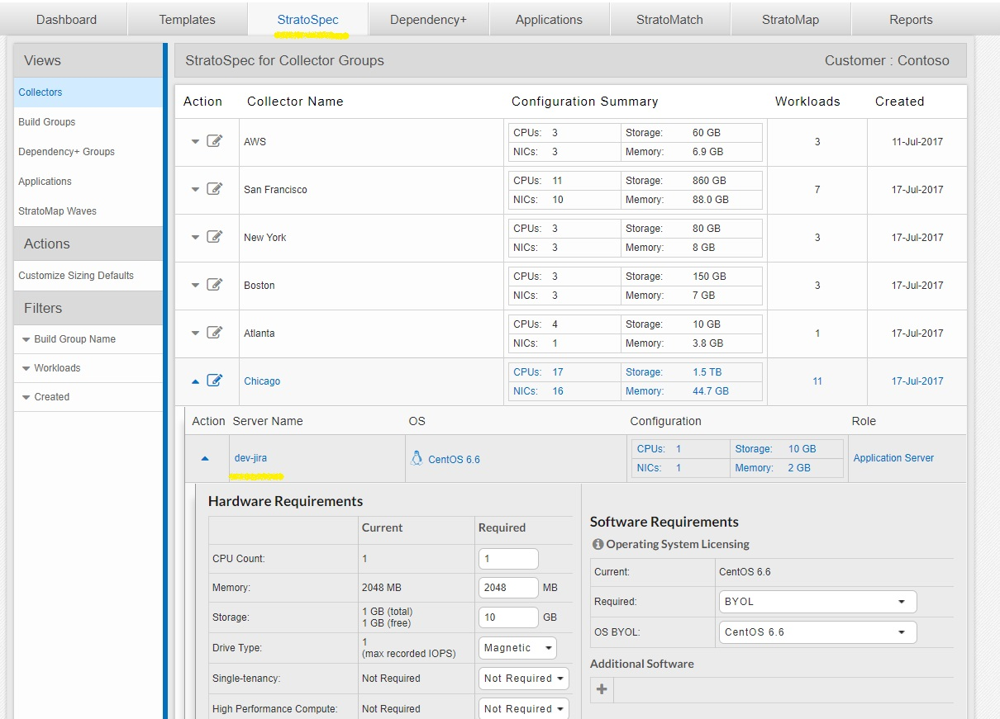

   * On the left side of the page, click on "Customize Sizing Defaults" to view the shaping matrix. On this page you can determine what your target host platform in Microsoft Azure would look like based on the specifications you provide and how much additional overhead you would require per virtual machine for peak workloads. Examine the different options that are available to you and that your enterprise may require. The target Azure platform which is recommended will be determined based on the answers here in terms of CPU, memory, and even OS licensing requirements (if any).

   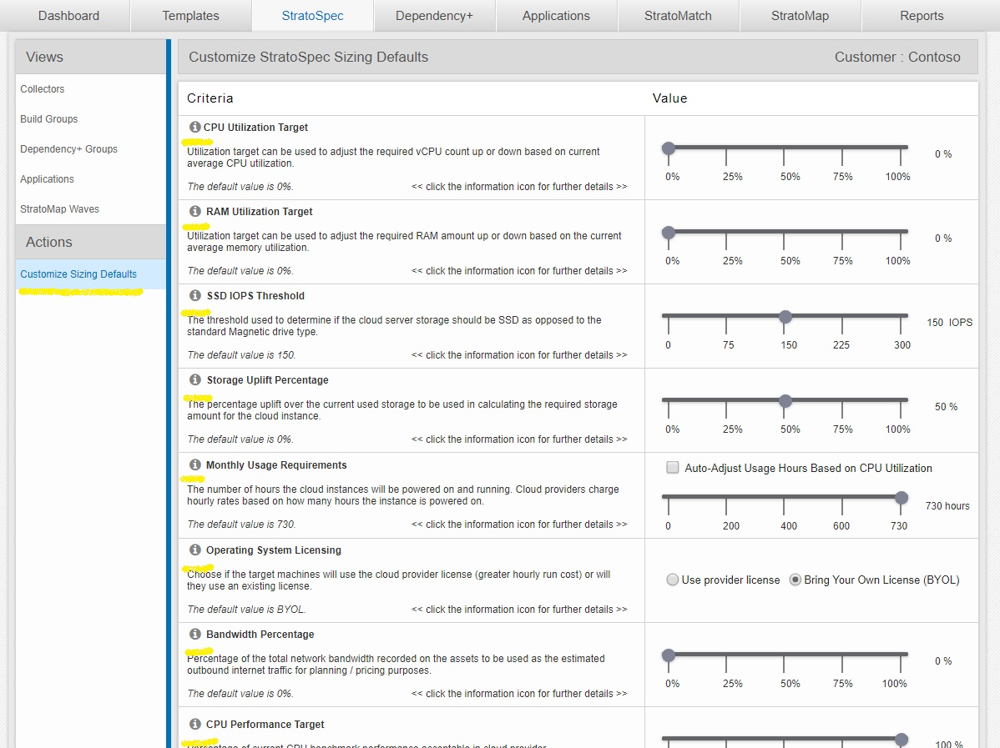

   * After you have finished shaping your environment on the "Customize Sizing Defaults" screen, click the "StratoMatch" tab at the top of the screen.  When the new screen appears, click the "Chicago" Collector to view the StratoMatch results for the Chicago data center.

   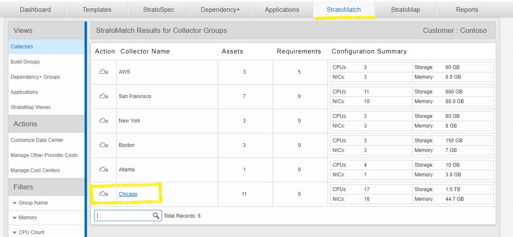

   * The overview that is provided below shows the monthly and three year cost estimates for all of the hosts in a given data center. The default option of Microsoft Azure is selected and gives retail price estimates for a target Azure footprint based on the sizing parameters you have specified. The other two options include "Microsoft Azure -- managed by Rackspace" and "Private Data Center".  Explore and compare the cost of each footprint.

   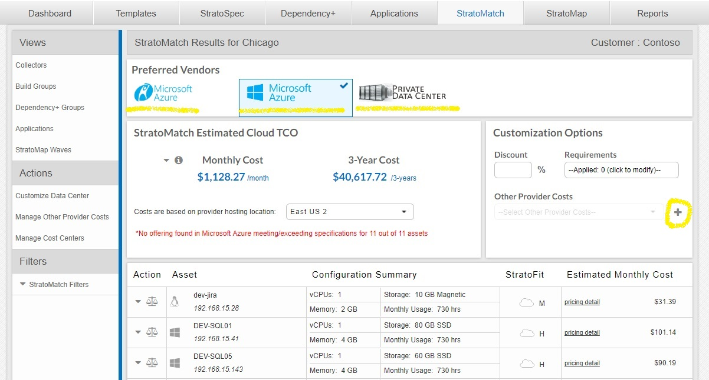

   * Expand the "dev-jira" server and you will see the different costs associated with that specific server, depending on the type of IaaS virtual machine you select for your Azure deployment. Clicking through the different virtual machines will show that each virtual machine presented will meet the resource requirements of the host allowing for various amounts of extra capacity. You can also click on the "scales" icon to show the cost comparison for that specific host.

   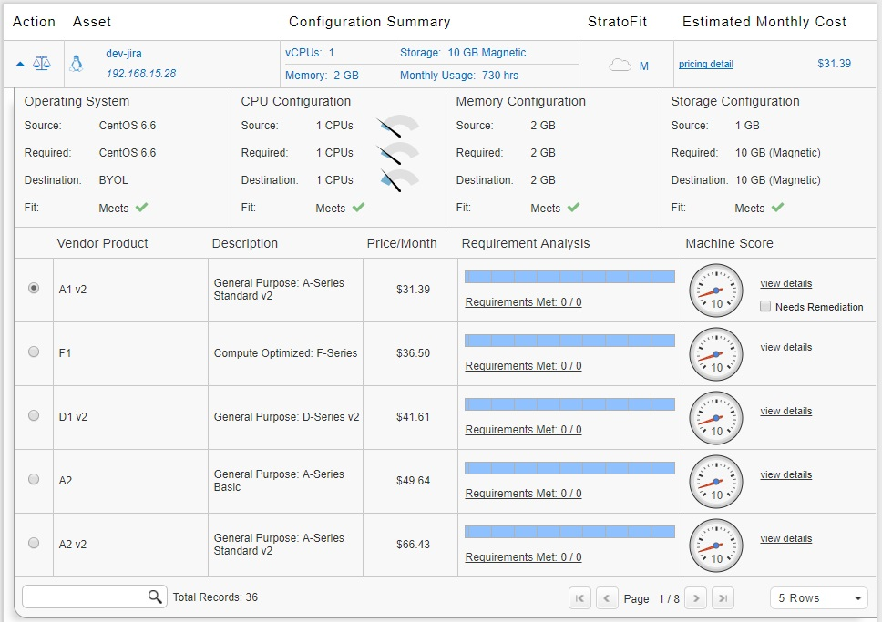

   * To generate a true TCO, a number of other values must be inserted into StratoZone. Click on the "+" symbol next to "Other Provider Costs" and "Add New Ohter Costs Center"

   

   * On this screen you will see additional options for services that should be included as part of the migration comparison estimates. The more data that is input into StratoZone, the more precise the TCO estimate will be.

   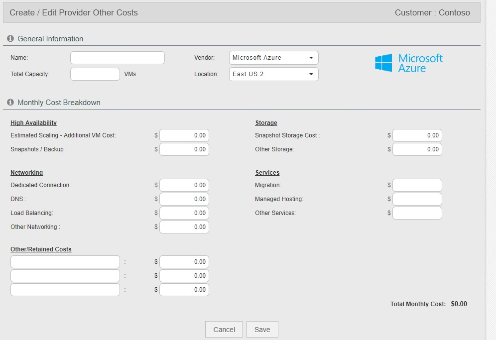

   * Click on the "Reports" tab and select the "StratoMatch Comparison" report.  Expand the Chicago data center and you will see the monthly infrastructure costs populate in this report and the savings that can be expected by migrating. Examine this and the other reports that are availabale to you in particular the "Cloud Fit Analysis - PaaS" report which shows applications that have been detected which could be replaced by Azure PaaS services.

   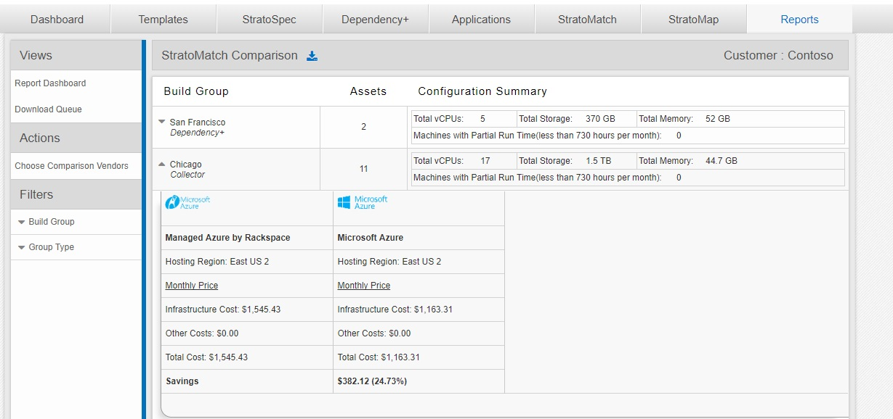

4. <strong>Create a Move Group and schedule a migration</strong>

   * Click on the "Options" icon next to the "Settings" icon in the upper-right corner of the screen; Choose Migrate

   

   * Choose the "Move Groups" tab

   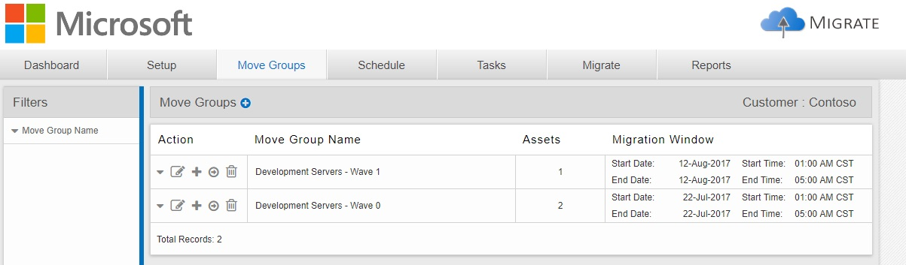

   * Click the "Edit Move Group Settings" icon in the first row that is present.  You will see the following information as well as many other options. StratoZone can seamlessly interact with CloudEndure or Azure Site Recovery to schedule and initiate a host/group migration.
      * Group Vendor: Azure
      * Vendor Region: East US 2
      * Move Type: CloudEndure
   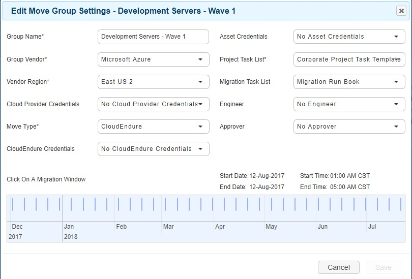

   * Ensure that the "dev-jira" host is present in one of the "Move Groups".  If it is not, add it.
   * Click on the "Migrate" tab and expand the move group that contains the "dev-jira" server. Clicking on the "thumbs up" icon will allow you to approve and schedule the migration. <strong>Do NOT schedule the migration.</strong>

   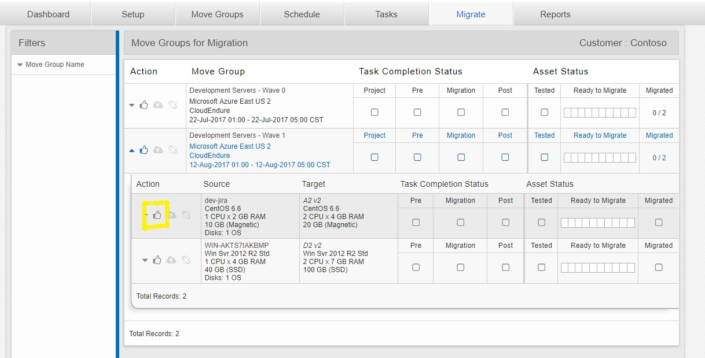
