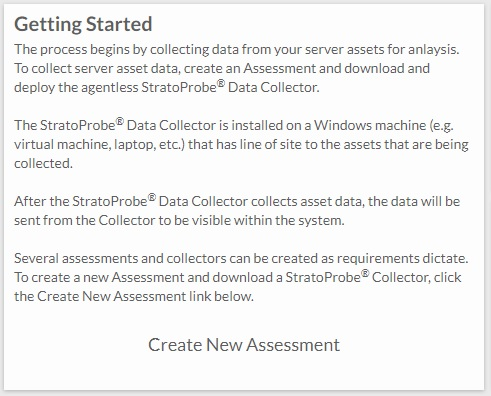
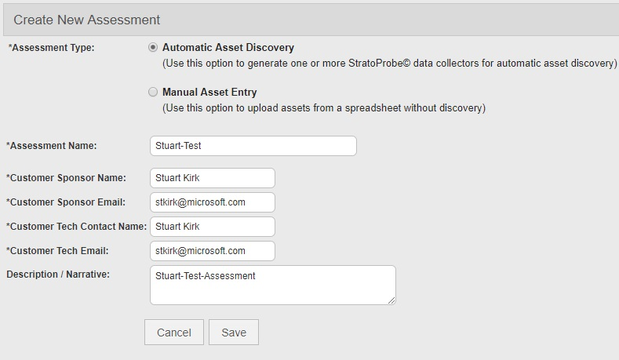
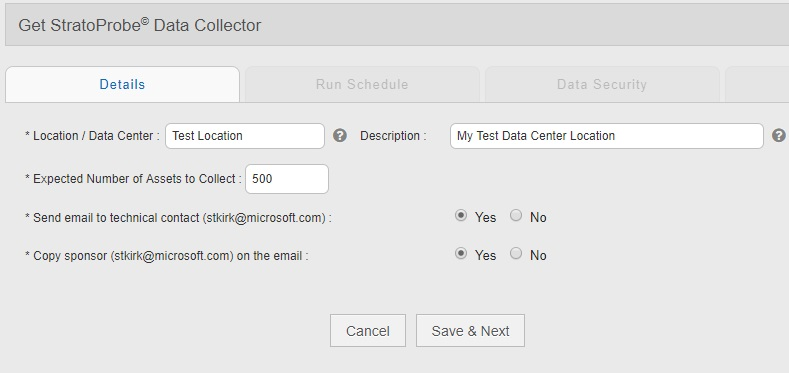
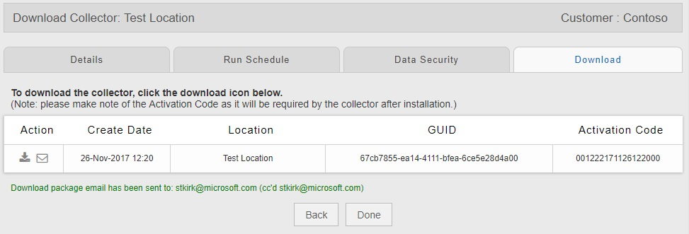
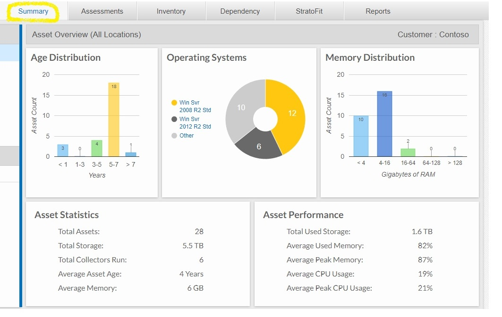
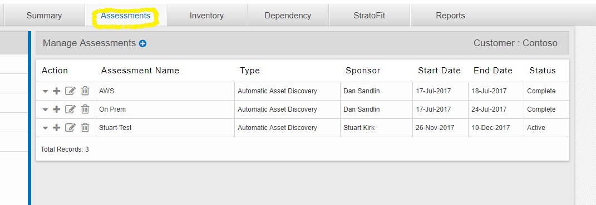
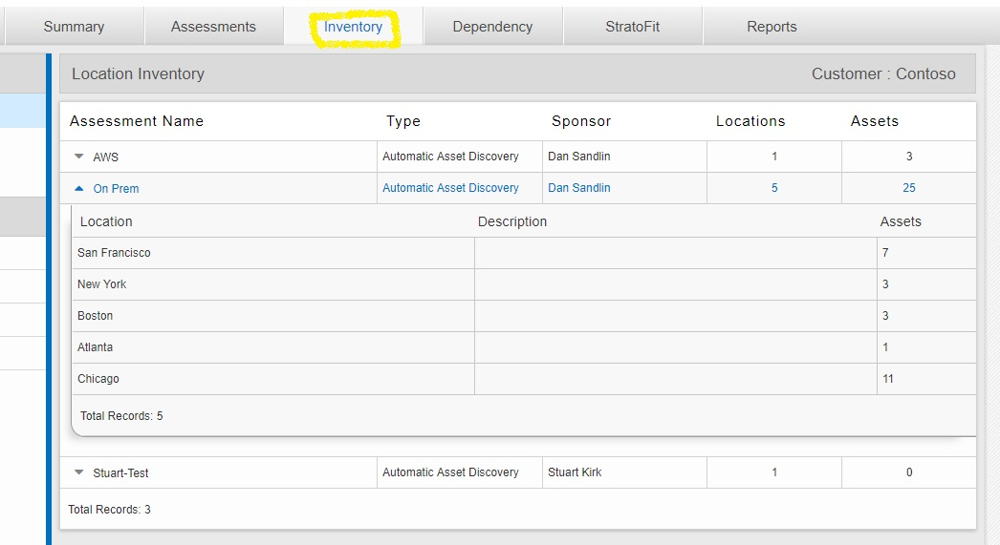
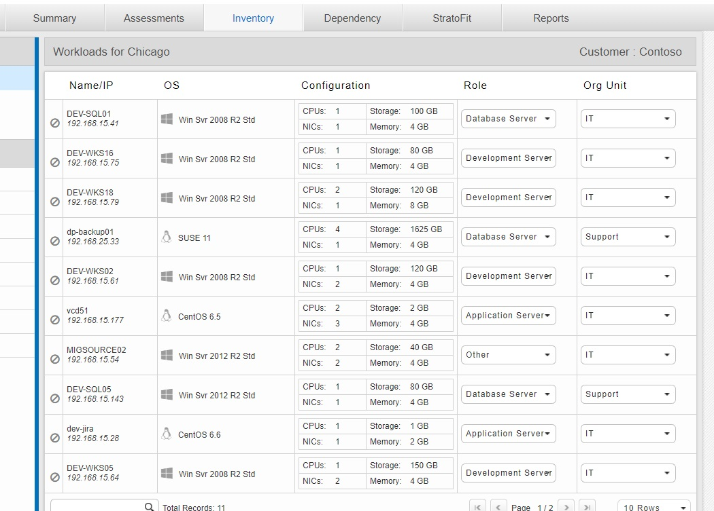

# Analyzing the value of a migration to Azure Review dependency mappings & financial analyses

## Expected Outcome

This challenge will provide you hands-on access to the StratoZone assessment tool.  By creating a new assessment and navigating through the tool, you will see how it is able to generate a number of reports on your source environment as you consider a migration to Microsoft Azure.  As part of this challenge we will examine the process of creating an assessment, reviewing data and cloud-fit scores, performing machine shaping and generating a financial model. You will also see how StratoZone is able to integrate with migration tools such as CloudEndure and ASR.

## Process

1. <strong>Create a new assessment</strong>
    * Follow the steps to create a new assessment
     

    * On the details tab, create a location for the assessment that represents a subset of your data center.
     

    * Do not change any of the details on Run Schedule or Data Security (can be changed by your administrators later) -- Just click "Save & Next"
    * The system will email the assessment package as shown on the Downloads tab.  Normally, you would deploy the agent(s) emailed to you onto the hosts in your data center, however for the purposes of this lab, the e-mail does not need to be used; We will use the sample data that already been pre-loaded into the StratoZone portal.
    

2. <strong>Review the data to be analyzed</strong>

    * After the assessment package has been generated, click "Done" then click on the "Summary" tab. Here can you see an overview of the data that has been collected by the agents which have been deployed.
    
    * Click on the "Assessments" tab. Multiple on-premise and cloud assessments can be done for all of your locations and will aggregate all of the data into StratoZone
    

    * Click on the "Inventory" tab. This tab will allow you to view the specific inventory sets that have been collected for all of the assessments which have been run.
    

    * In this example, we have expanded the inventory of the "Chicago" location which shows information on all of the host servers that have been registered.
    

