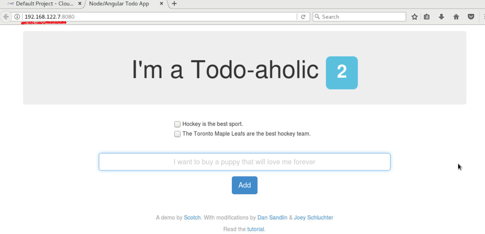
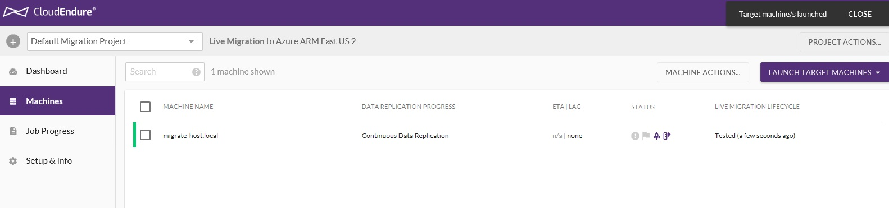
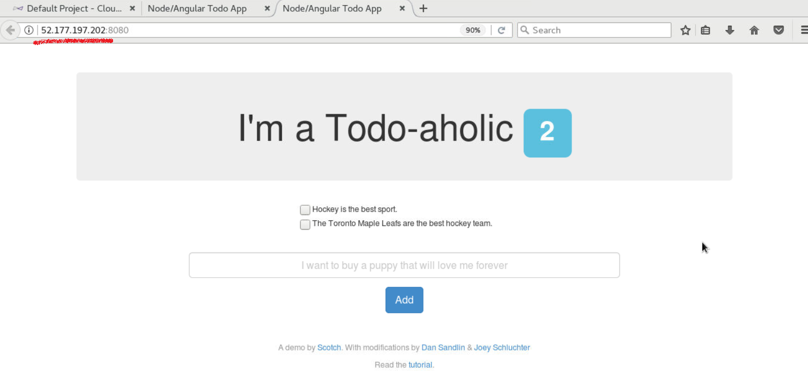

# Modernize Your Migrated VM using Azure Web Apps, Azure Container Registry, Azure CosmosDB and Docker

## Expected Outcome

This challenge provides a path to modernize the application running on the virtual machine which was migrated in the "CloudEndure Challenge 3" exercise.

Inside the "migrate-host" virtual machine, there is a NodeJS application running and exposed on port 8080. It connects to a locally running instance of MongoDB on "migrate-host" to store its data.

As part of this challenge, you will take the front-end NodeJS application and containerize it using Docker; You will then upload the container to Azure Container Registry.  For the back-end database, we will export the MongoDB data which ahs been entered into the NodeJS WebUI and import it into Azure CosmosDB. Finally the container which was uploaded to Azure Container Registry will be configured as an Azure Web App and deployed using the PaaS capabilities of this service.

At the end of the challenge, you should have the front-end NodeJS application running as a container inside Azure Web Apps, and the back-end database running in CosmosDB thus removing the need for the virtual machine to exist. This modernization effort is a valid next step in cloud transformation and adoption as workloads are abstracted and migrated to PaaS offerings which are natively available.

## Process

1. <strong>Access the running NodeJS application on the source "migrate-host" VM</strong>

    * Determine the IP address of the source "migrate-host" virtual machine; This is found in a text file on your Linux desktop.

    * Open a new FireFox web browser from within the Linux Desktop

    * Access the NodeJS application by visiting http://&lt;SOURCE-VM-IP-ADDRESS&gt:8080

      

2. <strong>Populate the local MongoDB with data using the NodeJS application</strong>

   * Add some content to the MongoDB using the NodeJS application by entering information in the submit box and clicking the "Add" button

   * Feel free to add as many/few lines of data into the database as you see fit

        

3. <strong>Perform another VM test with CloudEndure</strong>

    * Return back to the CloudEndure Console

    * Select the checkbox next to the "migrate-host" virtual machine, Click "Launch Target Machines" and select "Test".  This will cause a new VM instance to be created within Azure based on the current status of your source VM.  Since you have "updated" it by providing data to the NodeJS application / MongoDB environment, this should now also migrate to Microsoft Azure.

    * After the test is completed, this should reflect in the "Machines" tab

      

4. <strong>Wait for the VM test to complete</strong>

   * Ensure that the VM test migration has completed from Step 3

5. <strong>Verify that the NodeJS application is running in the Azure VM</strong>

   * Verify that the NodeJS application is still available on the migrated host.  Visit http://&ltMIGRATED-IP-ADDRESS&gt:8080

      

6. <strong>Add additional content to the MongoDB using the NodsJS application</strong>

   * Add some additional content to the MongoDB using the NodeJS application by entering information in the submit box and clicking the "Add" button

   * Be sure to perform this action on the <strong>NEWLY MIGRATED VM</strong> which you just viewed and <STRONG>NOT</STRONG> the source VM

      

7. <strong>Containerize the NodeJS Application</strong>

8. <strong>Create and Utilize Azure Container Registry</strong>

9. <strong>Create a CosmosDB and Perform a MongoDB Migration</strong>

10. <strong>Deploy the containerized NodeJS application as an Azure Web App</strong>

