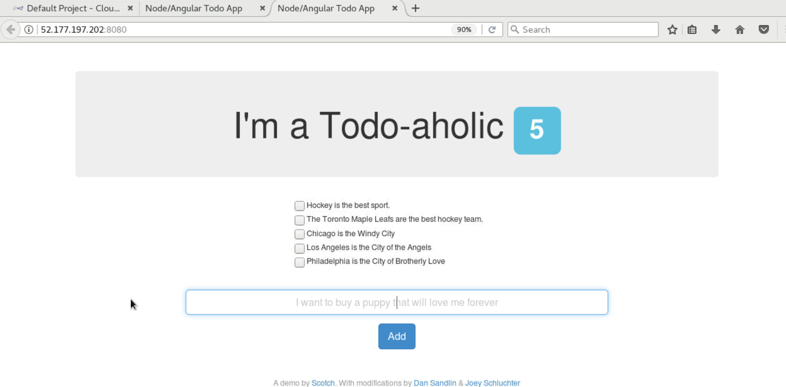
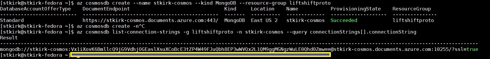
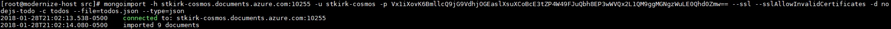

# Modernize Your Migrated virtual machine using Azure Web Apps, Azure Container Registry, Azure CosmosDB and Docker

## Expected Outcome

This challenge provides a path to modernize the application running on the virtual machine which was migrated in the "CloudEndure Challenge 3" exercise.

Inside the "migrate-host" virtual machine, there is a NodeJS application running and exposed on port 8080. It connects to a locally running instance of MongoDB on "migrate-host" to store its data.

As part of this challenge, you will take the front-end NodeJS application and containerize it using Docker; You will then upload the container to Azure Container Registry.  For the back-end database, we will export the MongoDB data which has been entered into the NodeJS WebUI and import it into Azure CosmosDB. Finally the container which was uploaded to Azure Container Registry will be configured as an Azure Web App and deployed using Azure's PaaS capabilities. 

At the end of the challenge, you should have the front-end NodeJS application running as a container inside Azure Web Apps, and the back-end database running in CosmosDB thus removing the need for the virtual machine to exist. This modernization effort is a valid next step in cloud transformation and adoption as workloads are abstracted and migrated to PaaS offerings.

## Process

1. <strong>Access the running NodeJS application on the source "migrate-host" virtual machine</strong>

    * Determine the IP address of the source "migrate-host" virtual machine; This is found in a text file on your Linux desktop.

    * Open a new FireFox web browser from within the Linux Desktop

    * Access the NodeJS application by visiting ```http://<SOURCE-VM-IP-ADDRESS>:8080```

      

<hr>

2. <strong>Populate the local MongoDB with data using the NodeJS application</strong>

   * Add some content to the MongoDB using the NodeJS application by entering information in the submit box and clicking the "Add" button

   * Feel free to add as many/few lines of data into the database as you see fit

        

<hr>

3. <strong>Perform another virtual machine test with CloudEndure</strong>

    * Return back to the CloudEndure Console

    * Select the checkbox next to the "migrate-host" virtual machine, Click "Launch Target Machines" and select "Test".  This will cause a new virtual machine instance to be created within Azure based on the current status of your source virtual machine.  Since you have "updated" it by providing data to the NodeJS application / MongoDB environment, this should now also migrate to Microsoft Azure.

    * After the test is completed, this should reflect in the "Machines" tab

      

<hr>

4. <strong>Wait for the virtual machine test migration to complete</strong>

   * Ensure that the virtual machine test migration has completed from Step 3
   * Determine the IP address of the newly tested virtual machine by visiting the "Target" tab in the CloudEndure console

<hr>

5. <strong>Verify that the NodeJS application is running in the virtual machine you migrated to Azure</strong>

   * Verify that the NodeJS application is still available on the migrated host and contains all of the data you've published to it.  Visit ```http://<MIGRATED-IP-ADDRESS>:8080```

      

<hr>

6. <strong>Add additional content to the MongoDB using the NodsJS application</strong>


   * Add some additional content to the MongoDB using the NodeJS application by entering information in the submit box and clicking the "Add" button

   * Be sure to perform this action on the <strong>NEWLY MIGRATED VIRTUAL MACHINE</strong> which you just viewed and <STRONG>NOT</STRONG> the source virtual machine. At this point, we will no longer make use of the source "migrate-host" virtual machine running inside your Linux desktop which you just migrated.

      

<hr>

7. <strong>Containerize the NodeJS Application</strong>

   * Ensure the <strong>"docker"</strong> RPM is installed on your migrate-host virtual machine.  If it isn't, install it:  ```yum -y install docker```

   * Ensure that <strong>"docker"</strong> is configured to start by systemd and that it is, in fact, started:  ```systemctl enable docker ; systemctl start docker```

   * Navigate to the NodeJS application's root directory: ```cd /source/sample-apps/nodejs-todo/src```

   * Edit the "<strong>Dockerfile"</strong> configuration file and change the port to be exposed from port 8080 to port 80 when the container is executed:  ```vi Dockerfile```

   * Edit the <strong>"server.js"</strong> configuration file and change the port which the application should listen on from port 8080 to port 80 when the container is executed:  ```vi server.js```

   * Edit the "<strong>/etc/mongod.conf"</strong> configuration file and comment out the "bindIp" directive which will force MongoDB to listen on all interfaces:  ```vi /etc/mongod.conf```

   * Restart mongod using systemctl:  ```systemctl restart mongod```

   * Containerize the application:  ```docker build -t ossdemo/nodejs-todo .```

   * Verify that the container was indeed created:  ```docker images```

   * Run the container locally to test it:  ```docker run -d -e MONGO_DBCONNECTION=mongodb://172.17.0.1:27017/nodejs-todo -p 80:80 --name=nodejs-todo ossdemo/nodejs-todo```

<hr>

8. <strong>Test the Local Container</strong>

   * Using your Firefox browser on your Linux desktop, navigate to ```http://<MIGRATED-IP-ADDRESS>:8080``` to verify the NodeJS application is still running natively on the newly-migrated Azure virtual machine.

   * Feel free to add additional content if you wish.

   * Now remove the reference to port 8080 and verify that the newly created and executed container is providing the NodeJS Application at:  ```http://<MIGRATED-IP-ADDRESS>```

   * Verify the data which you just entered (if any) is visible.  Feel free to add additional content if you wish.

<hr>

9. <strong>Create and Utilize Azure Container Registry</strong>

   * Using the Azure Linux CLI, create an Azure Container Registry:
       * Use the -n switch to give it a unique name, ex: <strong>firstnamelastnamebirthyear</strong>
       * Use the -g switch to specify the name of the resource group you have been assigned, ex: <STRONG>ODL-LIFTSHIFT-1234</STRONG>
       * Use the -l switch to specify the name of the Azure data center your resource group is in, ex: <strong>centralus</strong> or <strong>eastus</strong>

   * Create the registry: ```az acr create -n <NAME> -g <YOUR_RG> -l <YOUR_DC> --admin-enabled true --sku Basic

   * Tag the docker image using the name of the <strong>NAME</strong> obtained from the last step:  ```docker tag ossdemo/nodejs-todo <NAME>.azurecr.io/ossdemo/nodejs-todo```
 
   * Determine the password which Azure has assigned to your ACR:  ```az acr credential show -n <NAME> --query passwords[0].value```

   * Use docker to log in to your ACR using the password you just obtained from the previous step:  ```docker login <NAME>.azurecr.io -u <NAME> -p <PASSWORD>

   * Push the container you have built and tested to the ACR:  ```docker push <NAME>.azurecr.io/ossdemo/nodejs-todo```

<hr>

10. <strong>Create a CosmosDB and Perform a MongoDB Migration</strong>

   * Create a MongoDB-based Azure CosmosDB:
       * Use the -n switch to give it a unique name, ex: <strong>firstnamelastname-cosmos</strong>
       * Use the --kind switch to specify a MongoDB database
       * Use the -g switch to specify the name of the resource group you have been assigned, ex: <STRONG>ODL-LIFTSHIFT-1234</STRONG>

   * Create the CosmosDB:  ```az cosmosdb create --name <NAME> --kind MongoDB -g <YOUR_RG>```

   * In order for the to-be-created Azure Web App to connect to this CosmosDB we will need to determine what the connection string variable will be. This will also provide the password we will use to connect to the database. Use the Azure Linux CLI to determine this:  ```az cosmosdb list-connection-strings -g <YOUR_RG> -n <NAME> --query connectionStrings[].connectionString```
 
   

   * Export the data from your existing MongoDB to a JSON flat-file:  ```mongoexport --db nodejs-todo --collection todos --out todos.json```

   * To perform the CosmosDB importy, the password you will need to enter is provided to you in the connection string you just obtained and is underlined in the example above. In this particular example, the password is: <strong>Vx1iXovK6BmllcQ9jG9VdhjOGEaslXsuXCoBcE3tZP4W49FJuQbh8EP3wWVQx2L1QM9ggMGNgzWuLE0Qhd0Zmw==</strong>

   * Import the data from the JSON flat-file to CosmosDB:  ```mongoimport -h <NAME>.documents.azure.com:10255 -u <NAME> -p <PASSWORD> --ssl --sslAllowInvalidCertificates -d nodejs-todo -c todos --file=todos.json --type=json``` and look for output similar to this:

   

<hr>

11. <strong>Deploy the containerized NodeJS application as an Azure Web App</strong>

