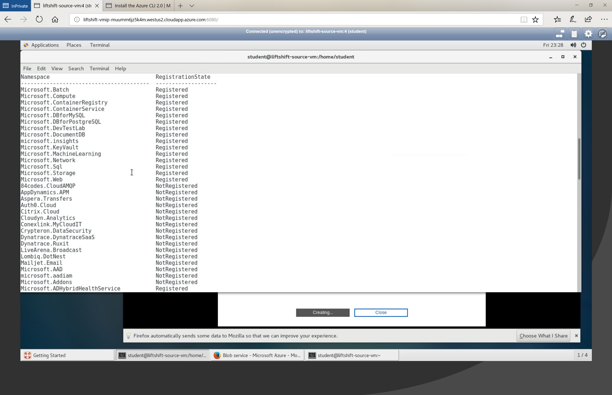
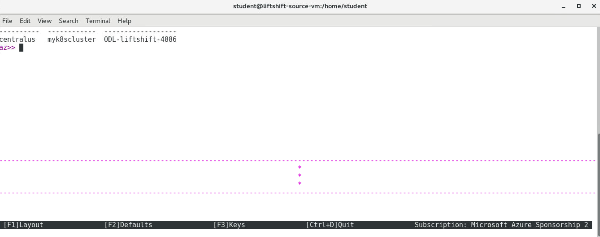
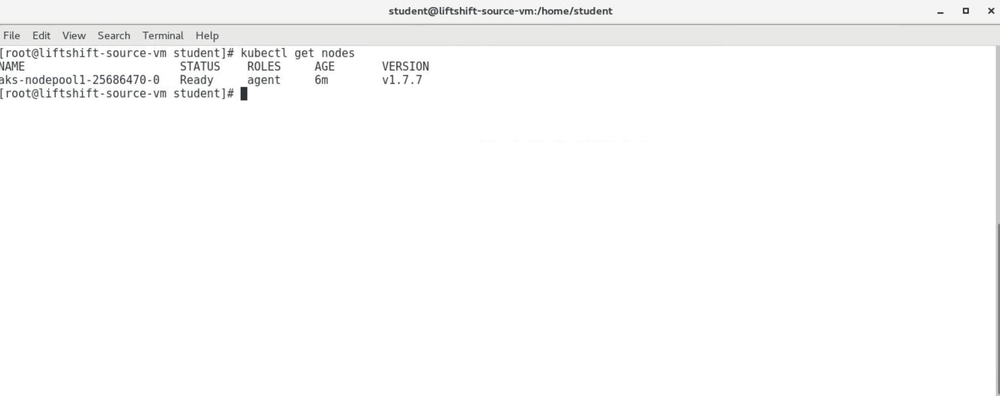

# Intro to Azure Container Service (AKS)

## Expected outcome

In this lab, you will get introduced to the new Azure Container Service (AKS). As you can tell the acronym doesn't match the wording, and that is because AKS is based off of the Kubernetes Orchestrator (the K in AKS). This lab will take you through verifying that your Azure CLI is registered to use the new service, along with having you create a Kubernetes container cluster and create your own yaml manifest file to stand up your first highly-available container application!

## How to 

1. <strong>Check Resource Providers</strong>

 * Starting from your workstation terminal screen, use Azure CLI to determine if your susbcription has access to the
 Microsoft.ContainerService provider (this is what allows you to submit AKS requests)
 * You will need to use the Azure CLI provider command to determine status: ``az provider`` followed by the necessary options

 

2. <strong>Create Kubernetes Cluster</strong>

 * Now that you have confirmed that you have access to the AKS provider, go ahead and create your first cluster
 * Use the ``az aks`` command to create your cluster
 * Create your AKS cluster using the service principal credentials provided to you
 * Set the number of nodes to 1
 * Try using Azure CLI Interactive, it will help you figure out format and what parameters are required
 * If you get stuck, check out the Azure CLI reference for AKS commands: [AZ CLI Reference](https://docs.microsoft.com/en-us/cli/azure/?view=azure-cli-latest)
 * It's not uncommon for this step to take 5-10 minutes to complete

 

3. <strong>Connect To Your Cluster</strong>

 * Make sure you are logged in as root in the terminal, if not execute the ``su`` command and use the same password that was given to log into your VNC server
 * Log out of AZ Interactive with ``exit`` if not done so already, we will be installing files in the OS
 * Azure CLI comes with built in commands under the ``az aks`` command sets that allow you to install the Kubernetes CLI (kubectl), run this command in your terminal window
 * Azure CLI also allows you to setup the configuration of kubectl to connect to your cluster, checkout the ``az aks get-credentials`` command after you have installed kubectl
 * Once configuration is complete you should be able to run ``kubectl get nodes`` to see a listing of the nodes available in your cluster

4. <strong>Deploy a manifest file</strong>

* In this section we will create pod.yaml manifest file to deploy to the Kubernetes clouster
* For creating the manifest file use the following structure to deploy a pod
``
apiVersion: v1
kind: Pod
metadata:
  name: my-pod
  labels:
spec:
  containers:
  - name: my-ctr
  image:
  ports:
``
* You will need to fill in the labels, image, and port in the correct format.
  * There should be 2 label values, one for zone which is equal to prod and one for version which is equal to v1
  * The image you want to use is equal to ``evillgenius/kuar:1``
  * You will want to open port ``8080`` for the container
* Use the ``kubectl create`` command to deploy this .yaml file.
## Advanced areas to explore

1. 
