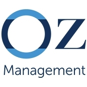

# Migrating Linux workloads to Microsoft Azure
 Och-Ziff Capital Management - November 6th, 2018 

This repository contains practical exercises for the Azure Linux Migration Workshop to be delivered at Och-Ziff Capital management on Tuesday November 6th, 2018. This repository is a subset of the Azure Linux Migration Workshop program which was delivered by Microsoft in 2017-2018.  The intent of this workshop is to provide hands-on experience with:

	* Working with the Azure Linux CLI
        * Provisioning open source workloads in Microsoft Azure
	* Migrating a virtual machine to Azure using CloudEndure
	* Modernizing a running application using Azure PaaS services
