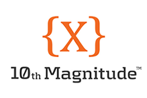
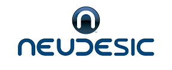
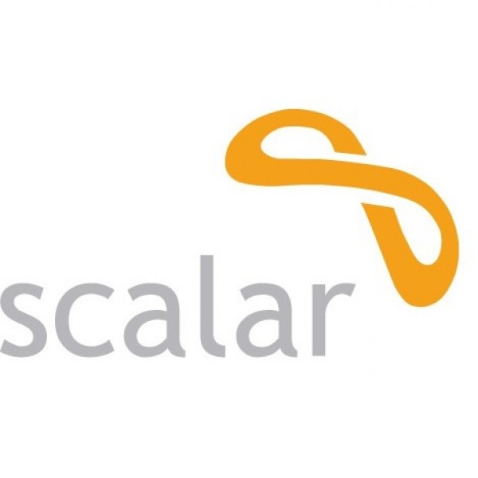

# The creators wish to thank....

A number of people have contributed to the development of this migration hackfest program. We wish to thank them here:

<table border=0>
<tr>
<td width="500">

### Microsofties
* Brian Redmond
* Dan Sandlin
* Eddie Villalba
* Srini Ambati
* Todd Hammer

### Spektra Systems Team
* Manesh Pillai

### CloudEndure Team
* Gonen Stein
* Leonid Feinberg

### StratoZone Team
* Karl Koshy
* Pete Benedetti 

### Docker Team
* Betty Junod
* Marc Monplaisir
* Mike Coleman
* Morgan Pettis

### Logistics Team
* Jenna Preston
* Kevin Engman
* Kristee Dicicco

</td>
<td>

 

 

 

</td>
</tr>
</table>

We would also like to thank our valued SI partners that will be co-presenting this series with us:

Thank you all for your steadfast support in the coordination, programming and testing of this workshop. 

### Stuart Kirk & Sean Mikha Lead Developers
